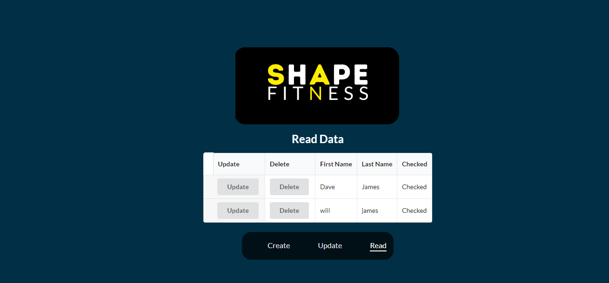
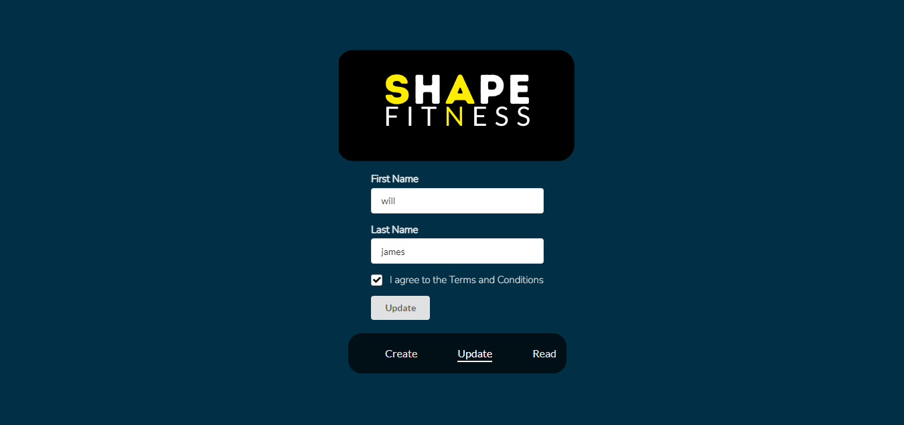
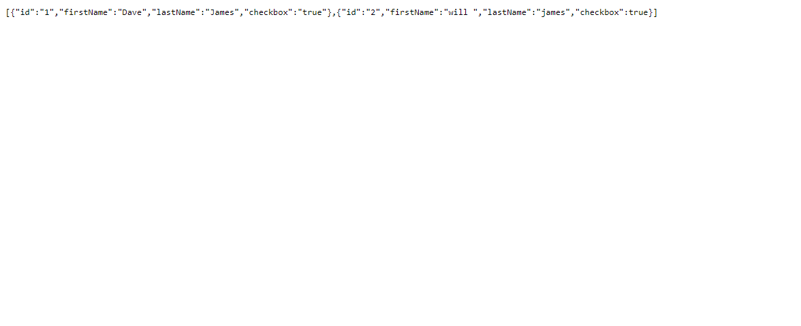

#  React Crud App For Shape Fitness

#  INTRODUCTION
   

For this app I created a Crud Application for Shape fitness a company 
I made up  for the purpose of this Crud App. I used a Mock REST API to make the Get, POST, DELETE, UPDATE
 Requests. I used Semantic Ui React for the forms as you   Can see below .In this Project I learned  more about 
 React Hooks specifically the UseEFFect hook to make api Calls  in React and 
 React onlick Events I created a small navbar at the bottom of the form to navigate to each page 
 and delete and update buttons on the form to change the data on the API  I also learned about
 the useNavigate Hook to navigate pages once a user submits data into a  form   I used local storage to store all
 the data Locally in the browser.

#  TECHNOLOGY USED
REACT ROUTER 
AXIOS LIBRARY 
REACT  

 #  SCREENSHOTS
 
 
 

